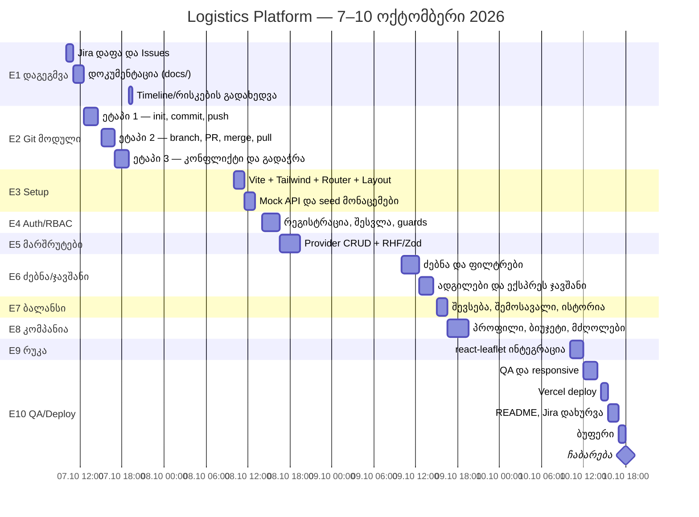

# 4. Timeline / Gantt

**პერიოდი:** 7–10 ოქტომბერი, 2026 · **ფორმატი:** ინდივიდუალური · **დაფა:** Jira `LOG` (Timeline ხედი)

## Gantt დიაგრამა

## დღიური განრიგი

### დღე 1 — ოთხშაბათი, 7 ოქტომბერი · დაგეგმვა და Git

| დრო | Epic | ამოცანა | შედეგი |
|---|---|---|---|
| 10:00–11:00 | E1 | Jira დაფა, ეპიკები, Issues | Jira `LOG` |
| 11:00–12:30 | E1 | დოკუმენტაცია | `docs/` |
| 12:30–14:30 | E2 | Git ეტაპი 1 | საჯარო რეპო, Initial commit |
| 15:00–17:00 | E2 | Git ეტაპი 2 + pull + PR | `feature-header` merge |
| 17:00–19:00 | E2 | Git ეტაპი 3 | კონფლიქტის გადაჭრა, push |
| 19:00–19:30 | E1 | გადახედვა | განახლებული Timeline/რისკები |

✅ **Milestone:** React LO1 (დაგეგმვა) და Git LO1–3 დასრულებულია.

### დღე 2 — ხუთშაბათი, 8 ოქტომბერი · საფუძველი, როლები, მარშრუტები

| დრო | Epic | ამოცანა |
|---|---|---|
| 10:00–11:30 | E3 | Vite, Tailwind, Router, Layout (გაერთიანებული ნავიგაცია) |
| 11:30–13:00 | E3 | Mock API, seed მონაცემები |
| 14:00–16:30 | E4 | რეგისტრაცია/შესვლა, Guest რეჟიმი, route guards |
| 16:30–19:30 | E5 | მარშრუტის CRUD, ვალიდაცია |

### დღე 3 — პარასკევი, 9 ოქტომბერი · ძებნა, ჯავშანი, ბალანსი, კომპანია

| დრო | Epic | ამოცანა |
|---|---|---|
| 10:00–12:30 | E6 | ძებნა, ფილტრები, სორტირება, URL params |
| 12:30–14:30 | E6 | ადგილების არჩევა, ჯავშანი, overbooking-ის პრევენცია |
| 15:00–16:30 | E7 | ბალანსის შევსება, შემოსავალი, ტრანზაქციები |
| 16:30–19:30 | E8 | კომპანიის პროფილი, ბიუჯეტი, მძღოლები |

### დღე 4 — შაბათი, 10 ოქტომბერი · რუკა, QA, ჩაბარება

| დრო | Epic | ამოცანა |
|---|---|---|
| 10:00–12:00 | E9 | რუკა, მარკერები, მარშრუტის ხაზი |
| 12:00–14:00 | E10 | QA: როლები, responsive, მდგომარეობები |
| 14:30–15:30 | E10 | Vercel deploy |
| 15:30–17:00 | E10 | README, დოკუმენტაციის დასრულება, Jira Done |
| 17:00–18:00 | — | ბუფერი |

🏁 **Milestone:** ჩაბარება — 10 ოქტომბერი, 18:00.

## Milestones

| თარიღი | Milestone |
|---|---|
| 07.10, 19:30 | დაგეგმვის ფაზა და Git მოდული დასრულებული |
| 08.10, 19:30 | ავტორიზაცია, RBAC და მარშრუტების CRUD მუშაობს |
| 09.10, 19:30 | ძებნა, ჯავშანი, ბალანსი, კომპანია მუშაობს |
| 10.10, 18:00 | Deploy და ჩაბარება |
